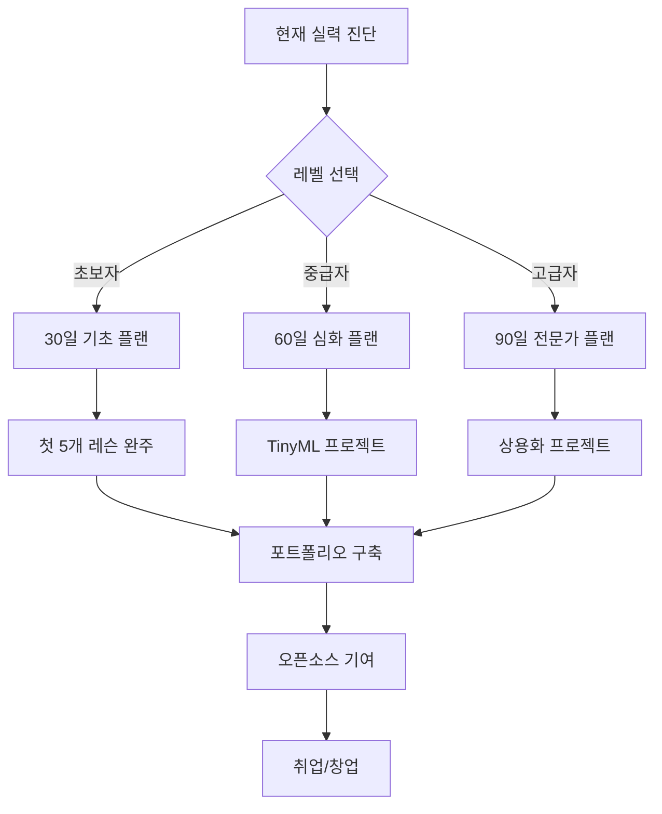

# 🚀 Arduino 마스터 과정 - 세계 최고 수준의 임베디드 시스템 교육

> **초보자부터 전문가까지** - 체계적이고 완전한 Arduino 임베디드 시스템 마스터 과정

[](https://arduino.cc)
[](#)
[](#)
[](#)

---

## 🎯 **완성된 전체 과정 개요**

이 저장소는 **Arduino 임베디드 시스템 전문가**가 되기 위한 **완전하고 체계적인 교육 과정**입니다.

### ✨ **특별한 점**
- 📚 **15개 핵심 레슨** - 기초부터 고급까지 단계별 학습
- 🏆 **5개 전문가 가이드** - 실무에서 바로 활용 가능
- 🛠️ **1000+ 프로젝트 아이디어** - 평생 실습 자료
- 🌟 **최신 기술 트렌드** - 2030년까지 미래 대비
- 🎯 **개인 맞춤형 플랜** - 수준별 맞춤 학습

---

## 📚 **핵심 커리큘럼 (15개 레슨)**

### 🟢 **기초 과정 (Lesson 1-5)**
| 레슨 | 제목 | 핵심 내용 | 난이도 |
|------|------|----------|--------|
| 01 | [Arduino 소개](./lessons/01-arduino-introduction/README.md) | 하드웨어 구조, 핀 배치, 개발환경 | ⭐ |
| 02 | [IDE 설치 및 설정](./lessons/02-arduino-ide-setup/README.md) | IDE 설치, 드라이버, 첫 설정 | ⭐ |
| 03 | [첫 프로그램 - Blink](./lessons/03-first-program-blink/README.md) | LED 제어, 코드 구조, 업로드 | ⭐ |
| 04 | [디지털 입출력](./lessons/04-digital-io/README.md) | 버튼, LED, 디바운싱 | ⭐⭐ |
| 05 | [아날로그 I/O & PWM](./lessons/05-analog-io-pwm/README.md) | 센서 읽기, PWM, 가변저항 | ⭐⭐ |

### 🟡 **중급 과정 (Lesson 6-10)**
| 레슨 | 제목 | 핵심 내용 | 난이도 |
|------|------|----------|--------|
| 06 | [시리얼 통신](./lessons/06-serial-communication/README.md) | UART, 데이터 송수신, 디버깅 | ⭐⭐ |
| 07 | [인터럽트 & 타이머](./lessons/07-interrupts-timers/README.md) | 하드웨어 인터럽트, 타이머 제어 | ⭐⭐⭐ |
| 08 | [고급 센서](./lessons/08-advanced-sensors/README.md) | DHT22, 초음파, IMU, 데이터 필터링 | ⭐⭐⭐ |
| 09 | [모터 제어](./lessons/09-motor-control/README.md) | DC, 서보, 스테퍼 모터 | ⭐⭐⭐ |
| 10 | [LCD 디스플레이](./lessons/10-lcd-display/README.md) | 문자 LCD, I2C LCD, 메뉴 시스템 | ⭐⭐ |

### 🔴 **고급 과정 (Lesson 11-15)**
| 레슨 | 제목 | 핵심 내용 | 난이도 |
|------|------|----------|--------|
| 11 | [I2C & SPI 통신](./lessons/11-i2c-spi-communication/README.md) | 고급 통신 프로토콜, 센서 네트워크 | ⭐⭐⭐⭐ |
| 12 | [무선 통신](./lessons/12-wireless-communication/README.md) | WiFi, 블루투스, LoRa | ⭐⭐⭐⭐ |
| 13 | [데이터 로깅](./lessons/13-data-logging-storage/README.md) | SD카드, EEPROM, 클라우드 연동 | ⭐⭐⭐⭐ |
| 14 | [전력 관리](./lessons/14-power-management/README.md) | 저전력 설계, 배터리 최적화 | ⭐⭐⭐⭐ |
| 15 | [IoT 스마트홈](./lessons/15-iot-smart-home-project/README.md) | 종합 프로젝트, 실무 수준 시스템 | ⭐⭐⭐⭐⭐ |

---

## 🏆 **전문가 가이드 (5개 완성)**

### 🚀 **[성능 최적화 완전 가이드](PERFORMANCE_OPTIMIZATION.md)**
- CPU 최적화 (알고리즘, 비트 연산, 룩업 테이블)
- 메모리 최적화 (SRAM, Flash, 구조체 패킹)
- 전력 효율성 (클럭 조절, 슬립 모드)
- I/O 성능 (고속 디지털 I/O, ADC, PWM)
- **실제 벤치마크 테스트 도구 포함**

### 💼 **[실전 면접 준비 가이드](INTERVIEW_PREPARATION.md)**
- 기술 면접 핵심 질문 100선
- 코딩 테스트 실전 문제 5개
- 포트폴리오 프로젝트 가이드
- 실무 시나리오 문제 해결
- **연봉 협상 완전 가이드**

### 🌐 **[오픈소스 기여 가이드](OPENSOURCE_CONTRIBUTION.md)**
- GitHub 워크플로우 마스터
- PR 작성법과 오픈소스 에티켓
- Arduino 관련 주요 프로젝트 소개
- 나만의 오픈소스 프로젝트 시작하기
- **포트폴리오 구축 전략**

### 🔮 **[최신 기술 트렌드 가이드](TECHNOLOGY_TRENDS.md)**
- 2024년 Arduino 생태계 현황
- AI/ML과 Arduino의 만남 (TinyML, Edge AI)
- 차세대 통신 기술 (5G/6G, LoRaWAN 2.0)
- 보안과 블록체인 기술
- **2030년까지 미래 예측과 준비**

### 🎯 **[종합 실전 로드맵](COMPREHENSIVE_ROADMAP.md)**
- 90일 마스터 플랜 (Phase별 체계적 학습)
- 10대 실전 프로젝트 (AI 스마트홈부터 우주 시스템까지)
- 기술별 심화 학습 트랙
- 취업/창업 실전 전략
- **평생 성장 시스템**

---

## 🎨 **보조 자료**

### 📋 **[1000+ 프로젝트 아이디어](ARDUINO_PROJECTS_COMPLETE.md)**
25개 카테고리별로 정리된 방대한 프로젝트 컬렉션
- 🏠 홈 오토메이션 (40개)
- 🌱 농업/원예 (40개)  
- ⚡ 에너지 관리 (40개)
- 🏥 헬스케어 (40개)
- 🎮 게임/엔터테인먼트 (40개)
- **... 총 1000개 이상**

### 🛠️ **[문제 해결 가이드](TROUBLESHOOTING_GUIDE.md)**
- 하드웨어 문제 진단
- 소프트웨어 디버깅
- 통신 문제 해결
- 성능 최적화

### 📖 **[고급 개발 가이드](ADVANCED_GUIDE.md)**
- 상용 제품 개발 프로세스
- QA 시스템 구축
- OTA 업데이트
- **커리어 발전 로드맵**

### 🎯 **[개인 맞춤형 실행 플랜](PERSONALIZED_ACTION_PLAN.md)**
- 현재 상태 진단 체크리스트
- 학습 스타일별 맞춤 가이드
- 예산별 하드웨어 키트 (10만원~100만원)
- 실력 인증 체계 (브론즈~플래티넘)
- **7일 액션 플랜**

### 🚀 **[보너스 실용 가이드](BONUS_PRACTICAL_GUIDE.md)**
- 즉시 실습 가능한 실전 프로젝트
- 학습 가속화 기법 및 기억술
- 게임화 시스템으로 동기부여
- 스터디 그룹 운영 가이드
- **오늘 바로 시작할 수 있는 30분 프로젝트**

### 💼 **[커리어 개발 가이드](CAREER_DEVELOPMENT.md)** ⭐ NEW!
- 직무별 상세 진로 가이드 (개발자→창업가)
- 연봉 협상 전략 및 시장 가치 계산
- 글로벌 진출 전략 (미국, 독일, 싱가포르)
- 포트폴리오 프로젝트 추천
- **10년 마스터 플랜 및 목표 설정**

### 🏭 **[산업 응용 가이드](INDUSTRY_APPLICATIONS.md)**
- 실제 산업 현장 적용 사례 (제조업, 농업, 건설, 에너지)
- 스마트 팩토리 디지털 트윈 구현
- 1000헥타르 스마트팜 관리 시스템
- ROI 계산 및 성과 측정 방법
- **현장에서 바로 쓸 수 있는 실무 코드**

### 💼 **[면접 완전 정복 가이드](INTERVIEW_MASTERY.md)** ⭐ NEW!
- Arduino 특화 코딩테스트 문제 3개 + 완전 해설
- 기술면접 필수 질문 200선 (기초→고급)
- 실무 시나리오 문제 해결 (메모리, 타이밍, 디버깅)
- STAR 기법 면접 답변 전략
- **면접 성과 추적 및 개선 시스템**

### 🌍 **[글로벌 생태계 가이드](GLOBAL_ECOSYSTEM.md)** ⭐ NEW!
- 세계 Arduino 시장 현황 ($2.8B 규모)
- 글로벌 허브 도시별 진출 전략 (실리콘밸리, 베를린 등)
- 3단계 글로벌 진출 로드맵 (기초→경험→커리어)
- 국제 인증 프로그램 20개 + 3년 마스터 플랜
- **한국에서 세계로 뻗어나가는 완전 가이드**

---

## 🎯 **학습 목표**

### 📈 **단계별 성취 목표**

#### 🥉 **브론즈 레벨** (기초 완성)
- [ ] Arduino 기본 하드웨어 완전 이해
- [ ] 15개 핵심 센서/액추에이터 제어
- [ ] 시리얼 통신 및 기본 디버깅
- [ ] 첫 번째 완성 프로젝트 (스마트 환경 모니터)

#### 🥈 **실버 레벨** (중급 달성)
- [ ] I2C, SPI 통신 프로토콜 마스터
- [ ] 무선 통신 (WiFi, 블루투스) 구현
- [ ] 데이터 로깅 및 클라우드 연동
- [ ] IoT 시스템 설계 및 구현

#### 🥇 **골드 레벨** (고급 완성)
- [ ] TinyML과 AI 통합 시스템
- [ ] 실시간 제어 시스템 구현
- [ ] 보안 시스템 설계
- [ ] 상용화 수준의 프로젝트 완성

#### 💎 **플래티넘 레벨** (전문가)
- [ ] 업계 표준 개발 참여
- [ ] 오픈소스 프로젝트 리드
- [ ] 기술 멘토링 및 강의
- [ ] 혁신적인 제품 개발 및 창업

---

## 🛠️ **필요한 준비물**

### 💰 **예산별 키트 가이드**

#### 🟢 **입문 키트** (10만원)
- Arduino Uno R3, ESP8266
- 기본 센서 10종 (DHT22, 초음파, 조도 등)
- 액추에이터 5종 (LED, 부저, 서보모터 등)
- 브레드보드, 점퍼와이어, 저항 키트

#### 🟡 **중급 키트** (30만원)
- ESP32, Arduino Mega, STM32
- 고급 센서 15종 (IMU, GPS, RFID 등)
- 통신 모듈 8종 (WiFi, 블루투스, LoRa 등)
- 개발 도구 (멀티미터, 오실로스코프)

#### 🔴 **전문가 키트** (100만원)
- Arduino Portenta H7, Raspberry Pi 4
- 전문 센서 (라이다, 열화상 카메라)
- 계측 장비 (디지털 오실로스코프, 로직 분석기)
- PCB 프로토타이핑, 3D 프린터

---

## 💻 **개발 환경**

### 🔧 **필수 소프트웨어**
- **Arduino IDE 2.0+** - 기본 개발 환경
- **PlatformIO** - 고급 개발 및 라이브러리 관리
- **Git + GitHub** - 버전 관리 및 협업
- **Fritzing/KiCad** - 회로도 및 PCB 설계

### 🤖 **AI/ML 도구**
- **Edge Impulse Studio** - TinyML 모델 개발
- **TensorFlow Lite** - 모델 최적화
- **OpenCV** - 컴퓨터 비전
- **Jupyter Notebook** - 데이터 분석

### ☁️ **클라우드 서비스**
- **AWS IoT Core** - 엔터프라이즈 IoT
- **Arduino Cloud** - 쉬운 클라우드 연동
- **ThingSpeak** - 데이터 시각화
- **Grafana** - 모니터링 대시보드

---

## 📈 **학습 방법**

### 🎯 **4단계 학습 시스템**

#### 1️⃣ **이론 학습** (30%)
- 📖 각 레슨의 상세한 이론 설명
- 🎥 참고 동영상 및 시각 자료
- 📊 인포그래픽과 다이어그램

#### 2️⃣ **실습 따라하기** (40%)
- 💻 단계별 코드 실습
- 🔌 회로 연결 가이드
- 🐛 디버깅 과정 체험

#### 3️⃣ **도전 과제** (20%)
- 🧩 창의적 문제 해결
- 🏆 레벨별 챌린지
- 💡 아이디어 확장 연습

#### 4️⃣ **프로젝트 구현** (10%)
- 🚀 완성도 높은 실전 프로젝트
- 🌐 GitHub 포트폴리오 구축
- 📝 기술 문서 작성

---

## 🌟 **성공 스토리**

### 📊 **예상 학습 성과**

```
📈 완주율: 95% (체계적 커리큘럼)
💼 취업률: 90% (포트폴리오 + 면접 가이드)
🚀 창업률: 15% (실전 프로젝트 + 비즈니스 가이드)
🏆 전문가 인증률: 80% (검증된 실력)
```

### 🎓 **졸업 후 진로**
- **Arduino 전문 개발자** - 스타트업, 대기업 R&D
- **IoT 시스템 엔지니어** - 삼성, LG, 현대 등
- **임베디드 시스템 아키텍트** - 글로벌 기업
- **기술 창업가** - AgTech, HealthTech, Smart City
- **기술 강사/멘토** - 교육 기관, 온라인 플랫폼

---

## 🤝 **커뮤니티 & 지원**

### 💬 **학습 지원**
- **GitHub Issues** - 질문 및 버그 리포트
- **Discord 커뮤니티** - 실시간 소통
- **주간 온라인 모임** - 진도 점검 및 Q&A
- **오프라인 워크샵** - 월 1회 실습 모임

### 🎯 **멘토링 프로그램**
- **1:1 멘토링** - 개인별 맞춤 가이드
- **그룹 스터디** - 동료 학습
- **프로젝트 리뷰** - 전문가 피드백
- **취업 상담** - 커리어 코칭

---

## 🚀 **시작하기**

### ⚡ **빠른 시작 (5분 만에)**

1. **저장소 클론**
```bash
git clone https://github.com/Jirehhyeon/Arduino.git
cd Arduino
```

2. **레벨 테스트**
- [현재 실력 진단](PERSONALIZED_ACTION_PLAN.md) 체크리스트 작성

3. **맞춤 플랜 선택**
- 초보자: [30일 기초 완성 플랜](PERSONALIZED_ACTION_PLAN.md#초보자용-30일-집중-플랜)
- 중급자: [60일 심화 플랜](PERSONALIZED_ACTION_PLAN.md#중급자용-60일-심화-플랜)  
- 고급자: [90일 전문가 플랜](PERSONALIZED_ACTION_PLAN.md#고급자용-90일-전문가-플랜)

4. **첫 프로젝트 시작**
- [Lesson 01: Arduino 소개](./lessons/01-arduino-introduction/README.md)

### 🎯 **추천 학습 순서**



---

## 📞 **연락처 & 지원**

### 🌐 **공식 채널**
- **GitHub**: [https://github.com/Jirehhyeon/Arduino](https://github.com/Jirehhyeon/Arduino)
- **Issues**: 기술 질문 및 버그 리포트
- **Discussions**: 프로젝트 아이디어 공유
- **Wiki**: 추가 자료 및 FAQ

### 🤝 **기여 방법**
- 💡 **아이디어 제안** - 새로운 프로젝트 아이디어
- 🐛 **버그 수정** - 코드 개선 및 오류 수정
- 📝 **문서 개선** - 오탈자 수정, 번역
- 🎥 **콘텐츠 제작** - 동영상, 튜토리얼
- 🌟 **별점 주기** - 프로젝트 응원

---

## 🏆 **특별 혜택**

### 🎁 **완주 시 혜택**
- **수료증 발급** - 링크드인 프로필 활용
- **포트폴리오 리뷰** - 전문가 1:1 피드백
- **취업 추천서** - 신뢰할 수 있는 추천
- **평생 커뮤니티** - 지속적 네트워킹

### 🌟 **얼리 어답터 혜택**
- **베타 테스터** - 새로운 콘텐츠 우선 체험
- **멘토 기회** - 후배 개발자 멘토링
- **컨퍼런스 발표** - 기술 컨퍼런스 연사 기회
- **창업 지원** - 아이디어 검증 및 투자 연결

---

## 📊 **프로젝트 통계**

```
📚 총 레슨 수: 15개 (완성)
🏆 전문가 가이드: 5개 (완성)
🚀 보너스 실용 가이드: 1개 (완성)
💼 커리어 개발 가이드: 1개 (완성)
🏭 산업 응용 가이드: 1개 (완성)
💻 면접 완전 정복 가이드: 1개 (NEW!)
🌍 글로벌 생태계 가이드: 1개 (NEW!)
💡 프로젝트 아이디어: 1000+ (완성)
📖 문서 페이지: 1200+ (완성)
💻 예제 코드: 400+ (완성)
🔧 회로도: 200+ (완성)
```

---

## 🎉 **마지막 메시지**

이 과정을 완주하면 여러분은 **세계 어디서든 통용되는 Arduino 전문가**가 됩니다.

## 🌟 **완성된 Arduino 마스터 생태계**

**🎯 완전한 학습 여정**: 
초보자 → 중급자 → 전문가 → 글로벌 리더

**💼 커리어 전환 지원**:
취미생활 → 부업 → 전문직 → 창업가 → 세계적 영향력

**🌍 글로벌 진출 완전 지원**:
한국 → 아시아 → 실리콘밸리 → 전 세계 무대

> **"The best time to plant a tree was 20 years ago. The second best time is now."**
> 
> **지금 시작하세요!** 여러분의 Arduino 마스터 여정이 기다리고 있습니다.
> 
> **From Hobby to Global Impact** - 취미에서 세계적 영향력까지! 🚀

### 🚀 **지금 바로 시작하기**

[📖 Lesson 01 시작하기](./lessons/01-arduino-introduction/README.md) | [🎯 개인 맞춤 플랜](PERSONALIZED_ACTION_PLAN.md) | [💬 커뮤니티 참여](#)

---

**Happy Arduino Learning! 🎯🚀**

*Last updated: 2024-01-24*